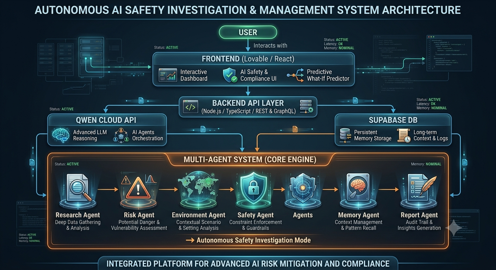

# 🧪 Dehinnet Kemi AI v2

## Autonomous Multi-Agent Chemical Safety Intelligence System with Persistent Memory

Dehinnet Kemi AI v2 is an AI-powered chemical safety intelligence platform designed to help laboratories, researchers, educational institutions, and industrial environments analyze chemical risks, predict hazards, and generate intelligent safety recommendations.

Built for the Qwen Cloud Global Hackathon, the platform combines persistent memory, multi-agent reasoning, and autonomous investigation workflows to improve chemical safety decision-making.

---

## 🚀 Key Features

### 🧠 Persistent Memory System

* Stores historical chemical analyses
* Remembers previous incidents and risk assessments
* Retrieves contextual safety knowledge
* Learns from prior investigations

### 🤖 Multi-Agent Architecture

The platform uses specialized AI agents that collaborate to produce comprehensive safety analyses:

* **Research Agent** — Chemical properties and scientific analysis
* **Risk Agent** — Hazard classification and risk prediction
* **Environment Agent** — Environmental impact assessment
* **Safety Agent** — Safety protocols and PPE recommendations
* **Memory Agent** — Historical analysis retrieval
* **Report Agent** — Final structured safety reports

### ⚡ Autonomous Investigation Mode

With one click, the system automatically:

* Performs chemical analysis
* Predicts hazards
* Evaluates environmental impact
* Searches historical memory
* Generates emergency procedures
* Produces a final safety report

---

## 🏗️ System Architecture
<div align="center">
  
</div>
User
   ↓
Frontend Application
   ↓
Backend Services
   ↓
Qwen Cloud API
   ↓
Multi-Agent System
      ├── Research Agent
      ├── Risk Agent
      ├── Environment Agent
      ├── Safety Agent
      ├── Memory Agent
      └── Report Agent
   ↓
Supabase Database
   ↓
Persistent Memory
```

---

## 🛠️ Built With

* Qwen Cloud API
* Alibaba Cloud
* Supabase
* TypeScript
* JavaScript
* React
* Vite
* Tailwind CSS
* Shadcn UI
* Multi-Agent Architecture
* Persistent Memory Systems
* REST APIs

---

## 🔧 Installation

Clone the repository:

```bash
git clone https://github.com/YOUR_USERNAME/YOUR_REPOSITORY.git
```

Navigate to the project:

```bash
cd dehinnet-kemi-ai
```

Install dependencies:

```bash
npm install
```

Start the development server:

```bash
npm run dev
```

---

## 🌐 Live Demo

Demo URL:

https://dehinnet-kemi-ai.vercel.app/

---

## 🎥 Demo Video

## 🎯 Hackathon Track

**Primary Track:** MemoryAgent

Additional capabilities demonstrated:

* Multi-Agent Collaboration
* Autonomous AI Workflows
* Persistent AI Memory

---

## 🔮 Future Work

Future development plans include:

* Real-time laboratory monitoring
* Chemical incident prediction
* Regulatory compliance automation
* Knowledge graph integration
* Edge AI deployment
* Advanced multi-agent collaboration

---

## 📄 License

This project is released under the MIT License.

---

## 👨‍💻 Author

Ayitegeb Tilahun

Built for the Qwen Cloud Global Hackathon 2026.
