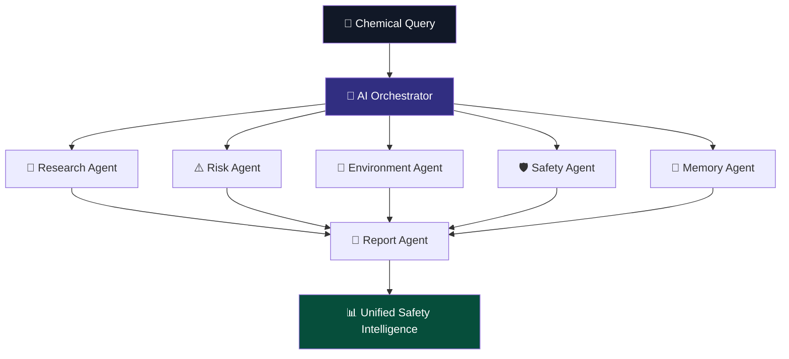
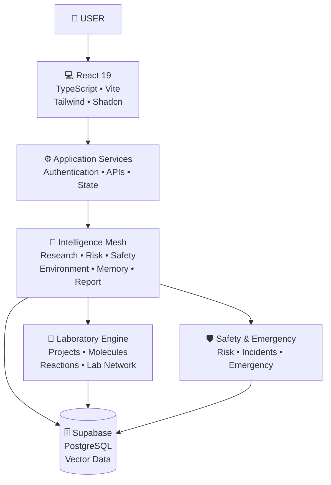

# 🧪 Dehinnet Kemi AI v2

### ደህንነት ኬሚ AI

<div align="center">


<br>

### ⚡ Understand Chemicals • Identify Risks • Improve Safety ⚡

<br>

<a href="YOUR_LIVE_DEMO_URL">

</a>
<a href="#-platform-features">

</a>
<a href="#-architecture">

</a>

<br><br>


<br><br>


</div>

---

# 🌌 What Is Dehinnet Kemi AI?

**Dehinnet Kemi AI v2** is an AI-powered chemical safety and laboratory intelligence platform designed to connect:

> 🧠 Artificial Intelligence
> 🧪 Chemistry
> ⚠️ Risk Intelligence
> 🛡️ Safety
> 🔬 Laboratory Workflows
> 🌍 Environmental Awareness

Instead of forcing users to switch between disconnected tools, Dehinnet Kemi AI brings chemical intelligence, safety analysis, scientific utilities, laboratory tools, emergency awareness, and AI assistance into a unified ecosystem.

<div align="center">

```text
             🧪 DEHINNET KEMI AI
                       │
        ┌──────────────┼──────────────┐
        │              │              │
        ▼              ▼              ▼
    🤖 AI          ⚠️ SAFETY       🧪 SCIENCE
 INTELLIGENCE      ENGINE          ENGINE
        │              │              │
        └──────────────┼──────────────┘
                       │
                       ▼
                 🔬 LAB TOOLS
                       │
                       ▼
                🚨 EMERGENCY
                       │
                       ▼
              🌍 SAFER DECISIONS
```

</div>

---

# ⚡ Platform at a Glance

<div align="center">

|      🤖 AI      |     🧠 Safety    |   🧪 Science  |    🔬 Laboratory   |    🚨 Emergency    |
| :-------------: | :--------------: | :-----------: | :----------------: | :----------------: |
| AI Intelligence |    Risk Engine   |  Chemical DB  |      Projects      | Emergency Response |
|   AI Assistant  | Health Predictor |    Elements   |  Molecule Builder  |       Safety       |
|  Safety History |   Human Impact   |   Calculator  | Reaction Simulator |      Incidents     |
|   Multi-Agent   |    Environment   | Chemical Data |    Lab Workspace   |       Alerts       |

</div>

---

# 🎯 Mission

> **Make chemical intelligence more accessible, organized, understandable, and safety-oriented through AI.**

Dehinnet Kemi AI explores how intelligent software can support:

```text
🔬 Chemical Research
        ↓
⚠️ Risk Awareness
        ↓
👤 Human Impact
        ↓
🌱 Environmental Impact
        ↓
🧪 Laboratory Intelligence
        ↓
🚨 Emergency Awareness
        ↓
📊 Safety Intelligence
```

---

# 🚀 Platform Features

<details open>
<summary><h2>🤖 Autonomous System</h2></summary>

## 🧠 AI Safety Intelligence

The central intelligence layer coordinates chemical and safety-oriented analysis.

### Capabilities

* 🔬 AI-assisted chemical analysis
* ⚠️ Automated risk assessment
* 🌱 Environmental analysis
* 👤 Human-impact analysis
* 🩺 Health-risk awareness
* 🛡️ Safety intelligence
* 📊 Structured safety outputs
* 🧠 Contextual analysis

```text
                 USER QUERY
                      │
                      ▼
             ┌────────────────┐
             │ AI INTELLIGENCE│
             └───────┬────────┘
                     │
       ┌─────────────┼─────────────┐
       ▼             ▼             ▼
    Research        Risk       Environment
       │             │             │
       └─────────────┼─────────────┘
                     │
              ┌──────┴──────┐
              ▼             ▼
           Safety         Health
              │             │
              └──────┬──────┘
                     ▼
             🧠 UNIFIED ANALYSIS
```

</details>

<details>
<summary><h2>📜 Safety History</h2></summary>

The Safety History system provides historical context for previous analyses and safety events.

Potential uses:

* Previous analysis records
* Historical risk information
* Safety-event tracking
* Analysis comparison
* Contextual intelligence
* Recurring-pattern awareness

</details>

---

<details>
<summary><h2>🧠 AI Safety Intelligence</h2></summary>

### 🩺 Health Predictor

AI-assisted analysis of potential health and exposure concerns.

### 👤 Human Impact

Analysis of potential human exposure and safety considerations.

### 🌱 Environment Impact

Environmental-impact awareness covering potential:

* Water concerns
* Soil concerns
* Air impact
* Ecosystem considerations
* Waste/disposal awareness

### 🔗 Environment-Human

Connects environmental exposure with human-impact considerations.

```text
             🧪 CHEMICAL
                  │
          ┌───────┴───────┐
          ▼               ▼
      🌱 ENVIRONMENT   👤 HUMAN
          │               │
          └───────┬───────┘
                  ▼
          🔗 CONNECTED
             ANALYSIS
```

### 📋 Incident

Structured incident recording and historical review.

### ⚠️ Risk Engine

A dedicated engine for organizing and evaluating risk-related information.

### 📊 AI Safety Score

Converts multiple analysis dimensions into an understandable safety indicator.

### 💬 AI Assistant

A conversational AI interface for chemical research, safety questions, and platform assistance.

</details>

---

<details>
<summary><h2>🚨 Emergency & Safety</h2></summary>

### 🚑 Emergency Response

Dedicated emergency-awareness workflows.

```text
🚨 INCIDENT
     │
     ▼
CLASSIFICATION
     │
     ▼
SAFETY INFORMATION
     │
     ├── Exposure Awareness
     ├── Immediate Precautions
     ├── Containment Awareness
     └── Emergency Resources
```

### 🛡️ Safety Center

Centralized safety information covering:

* PPE awareness
* Safe handling
* Storage considerations
* Workspace safety
* Chemical compatibility
* Laboratory precautions

</details>

---

<details>
<summary><h2>🧪 Science Engine</h2></summary>

### 🗄️ Chemical Database

Centralized chemical information.

```text
SEARCH
  │
  ▼
CHEMICAL DATABASE
  │
  ▼
CHEMICAL PROFILE
  ├── Properties
  ├── Classification
  ├── Safety
  └── Related Information
```

### ⚛️ Elements

Interactive element exploration.

### 🧮 Calculator

Scientific and chemical calculation utilities.

</details>

---

<details>
<summary><h2>🔬 Laboratory Tools</h2></summary>

### 📁 Projects

Organize research, experiments, and laboratory projects.

### 🧬 Molecule Builder

Interactive molecular structure exploration.

```text
ATOM
 ↓
SELECTION
 ↓
CONNECTION
 ↓
BOND
 ↓
🧬 MOLECULE
```

### ⚗️ Reaction Simulator

Controlled chemical-reaction simulation and visualization.

### 🧪 Lab

Digital laboratory workspace.

### 🌐 Lab Network

Connects laboratory workflows and collaborative scientific activities.

</details>

---

<details>
<summary><h2>⚙️ System</h2></summary>

### 🔔 Notifications

Important safety, analysis, project, and system events.

### 👤 Profile

Account and user preferences.

### 🛠️ Admin

Authorized administrative controls.

</details>

---

# 🧠 Multi-Agent Intelligence

Dehinnet Kemi AI v2 uses a specialized-agent architecture designed to divide complex analysis into focused responsibilities.

<div align="center">



</div>

### Agent Responsibilities

| Agent                | Responsibility                               |
| -------------------- | -------------------------------------------- |
| 🔬 Research Agent    | Chemical information and research processing |
| ⚠️ Risk Agent        | Hazard and risk analysis                     |
| 🌱 Environment Agent | Environmental-impact intelligence            |
| 🛡️ Safety Agent     | Safety-oriented analysis                     |
| 🧠 Memory Agent      | Historical/context retrieval                 |
| 📄 Report Agent      | Unified structured reporting                 |

---

# ⚡ Autonomous Investigation

One investigation can coordinate multiple intelligence processes.

```text
                    🚀 START
                      │
                      ▼
                🧪 CHEMICAL
                    INPUT
                      │
                      ▼
              🧠 ORCHESTRATOR
                      │
        ┌─────────────┼─────────────┐
        │             │             │
        ▼             ▼             ▼
     🔬 Research    ⚠️ Risk     🌱 Environment
        │             │             │
        └─────────────┼─────────────┘
                      │
             ┌────────┴────────┐
             ▼                 ▼
         🛡️ Safety          🧠 Memory
             │                 │
             └────────┬────────┘
                      ▼
                 📄 REPORT
                      │
                      ▼
              📊 SAFETY RESULT
```

---

# 🧠 Contextual Memory

The memory architecture allows historical information to become part of future analysis workflows.

```text
Previous Analysis
       │
       ▼
Historical Context
       │
       ▼
Semantic Retrieval
       │
       ▼
Relevant Information
       │
       ▼
New Chemical Query
       │
       ▼
Context-Aware Analysis
```

---

# 🏗️ System Architecture

<div align="center">



</div>

---

# 🛠️ Technology Stack

<div align="center">

### Frontend


### UI


### Backend & Data


</div>

---

# 📁 Project Structure

```text
dehinnet-kemi-ai/
│
├── 📁 src/
│   ├── 📁 components/
│   │   ├── ui/
│   │   ├── agents/
│   │   ├── chemical/
│   │   ├── laboratory/
│   │   ├── safety/
│   │   └── dashboard/
│   │
│   ├── 📁 pages/
│   ├── 📁 services/
│   │   ├── ai/
│   │   ├── chemical/
│   │   ├── safety/
│   │   └── laboratory/
│   │
│   ├── 📁 hooks/
│   ├── 📁 lib/
│   └── 📁 types/
│
├── 📁 public/
├── 📁 docs/
├── 📄 package.json
├── 📄 vite.config.ts
├── 📄 tailwind.config.ts
└── 📄 README.md
```

---

# 🚀 Installation

### 1️⃣ Clone

```bash
git clone https://github.com/YOUR-USERNAME/dehinnet-kemi-ai.git
cd dehinnet-kemi-ai
```

### 2️⃣ Install

```bash
npm install
```

### 3️⃣ Configure Environment

Create `.env.local`:

```env
VITE_SUPABASE_URL=your_supabase_project_url
VITE_SUPABASE_ANON_KEY=your_supabase_anon_key
VITE_AI_API_KEY=your_ai_api_key
```

### 4️⃣ Start Development

```bash
npm run dev
```

### 5️⃣ Build Production

```bash
npm run build
```

### 6️⃣ Preview

```bash
npm run preview
```

---

# 🔐 Security

Security is a core consideration because the platform may process user, laboratory, chemical, and organizational information.

Recommended protections include:

* 🔐 Authentication
* 🛡️ Authorization
* 🗄️ Database access policies
* 🔒 Row Level Security
* 🔑 Environment-variable protection
* ✅ Input validation
* 🚦 API rate limiting
* 📝 Audit logging
* 👤 User-data isolation
* 🔍 Secure API validation

```text
USER
  │
  ▼
🔐 AUTHENTICATION
  │
  ▼
🛡️ AUTHORIZATION
  │
  ▼
✅ VALIDATION
  │
  ▼
🧠 AI PROCESSING
  │
  ▼
🗄️ DATABASE
  │
  ▼
🔒 SECURE RESPONSE
```

> **Never commit API keys, database passwords, Supabase service-role keys, JWT secrets, private certificates, or other credentials to the repository.**

---

# ⚠️ Safety & Responsible Use

Dehinnet Kemi AI is an **AI-assisted information and decision-support platform**.

It does **not** replace:

* Certified Safety Data Sheets (SDS)
* Qualified chemical-safety professionals
* Laboratory safety officers
* Official regulatory authorities
* Emergency responders
* Institutional safety procedures

AI-generated information can be incomplete, inaccurate, or outdated.

Critical chemical decisions must always be independently verified through authoritative scientific and safety resources.

### 🚫 Never treat the platform as the sole authority for:

```text
❌ Emergency chemical response
❌ Medical treatment decisions
❌ High-risk chemical handling
❌ Industrial process authorization
❌ Regulatory certification
❌ Laboratory safety approval
```

---

# 🗺️ Roadmap

### 🟢 Current Platform

* [x] 🤖 AI Safety Intelligence
* [x] 📜 Safety History
* [x] 🩺 Health Predictor
* [x] 👤 Human Impact
* [x] 🌱 Environment Impact
* [x] 🔗 Environment-Human
* [x] 📋 Incident Management
* [x] ⚠️ Risk Engine
* [x] 📊 AI Safety Score
* [x] 💬 AI Assistant
* [x] 🚑 Emergency Response
* [x] 🛡️ Safety Center
* [x] 🗄️ Chemical Database
* [x] ⚛️ Elements
* [x] 🧮 Calculator
* [x] 📁 Projects
* [x] 🧬 Molecule Builder
* [x] ⚗️ Reaction Simulator
* [x] 🧪 Laboratory Workspace
* [x] 🌐 Lab Network
* [x] 🔔 Notifications
* [x] 👤 Profile
* [x] 🛠️ Administration

### 🔮 Future

* [ ] 🧠 Advanced persistent memory
* [ ] 📈 Advanced incident analytics
* [ ] 🌐 Laboratory collaboration
* [ ] 🏢 Enterprise safety dashboards
* [ ] 📱 Mobile application
* [ ] 🌍 Expanded multilingual support
* [ ] 🔬 Advanced scientific visualization
* [ ] 🔗 Additional laboratory integrations

---

# 🌍 Vision

```text
                         🧠 AI
                          │
             ┌────────────┼────────────┐
             │            │            │
             ▼            ▼            ▼
        🔬 RESEARCH    🛡️ SAFETY    🧪 LAB
             │            │            │
             └────────────┼────────────┘
                          │
                          ▼
                    🧪 CHEMICAL
                   INTELLIGENCE
                          │
                          ▼
                    ⚡ INSIGHT
                          │
                          ▼
                   🌍 SAFER WORLD
```

The long-term vision is to build an intelligent chemical ecosystem where research, safety, laboratory workflows, and AI-powered analysis can operate together.

---

# 📄 License

## 🔴 Proprietary — All Rights Reserved

**Copyright © 2026 Ayitegeb Tilahun. All Rights Reserved.**

Dehinnet Kemi AI, including its source code, software architecture, multi-agent orchestration design, interface design, visual system, documentation, branding, database structures, proprietary logic, and associated materials, is proprietary intellectual property.

Permission to view the repository may be granted for:

* Academic review
* Professional portfolio evaluation
* Educational inspection
* Authorized research review

No permission is granted to:

* Copy
* Reproduce
* Modify
* Redistribute
* Republish
* Sublicense
* Commercially exploit
* Mirror
* Repackage
* Create derivative works

without explicit prior written authorization from the copyright holder.

See [`LICENSE`](./LICENSE) for complete licensing terms.

---

# 👨‍💻 Core Architect

<div align="center">


### Lead System Engineer • Software Developer • AI Builder • Innovator

🇪🇹 **Ethiopia**

<br>

> **“Building intelligent technology for real-world problems.”**

<br>

### 🧪 DEHINNET KEMI AI

**AI × Chemistry × Safety × Laboratory Intelligence**

<br>


<br><br>


</div>
